# wecube-plugins-artifacts插件发包流程升级说明

## 升级目的

本次升级是为了实现私有差异化变量基于子系统设计Id进行隔离，因此需要更新CMDB中的差异化变量CI模型，增加子系统设计id属性，同时更改每个差异化变量的主键（唯一名称）填充方式；然后需要将平台现有的私有差异化变量更新一遍，给每个私有差异化变量增加对应的子系统设计id内容（脚本处理）

## 操作步骤

1. **插件注册**：首先将插件注册成功，然后需要更改【模型配置】内容

2. **模型配置**：在wecube导航中打开 设计--模型配置， 在模型配置中找到【差异化配置项】并点击，打开侧边栏

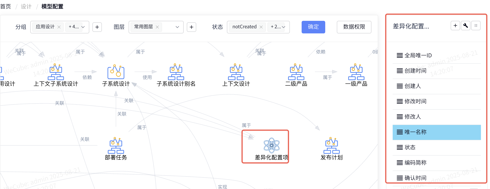

3. **增加属性**：点击右上角新增，增加一个 属性【子系统设计】

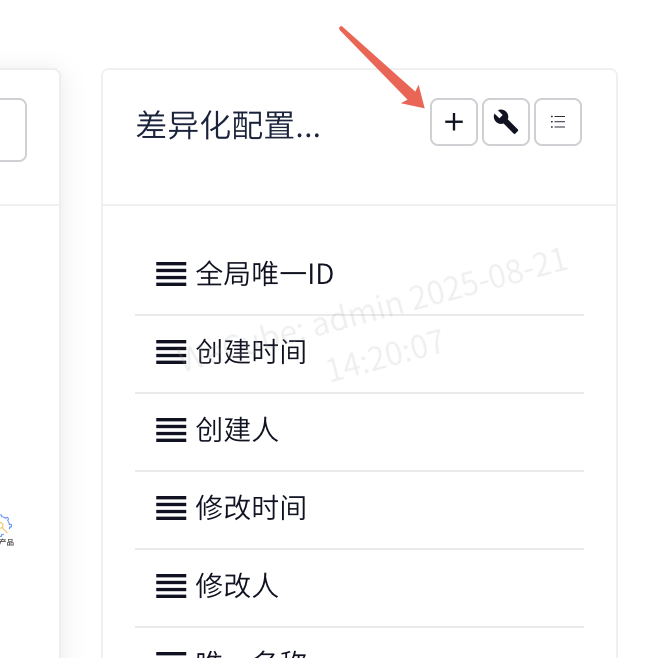
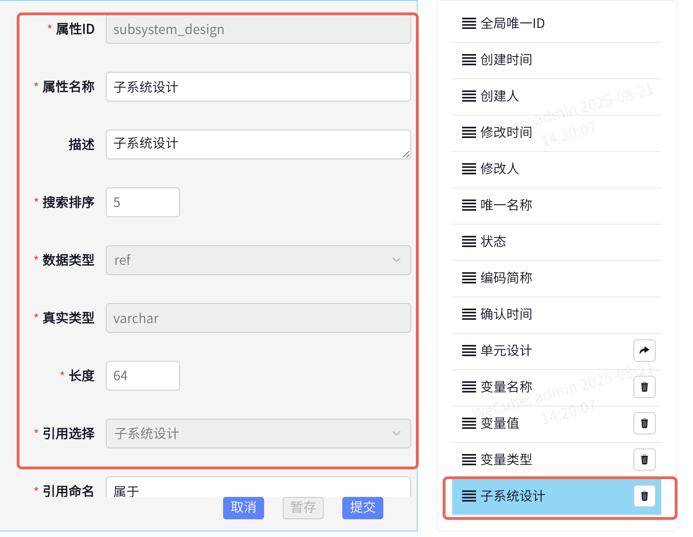
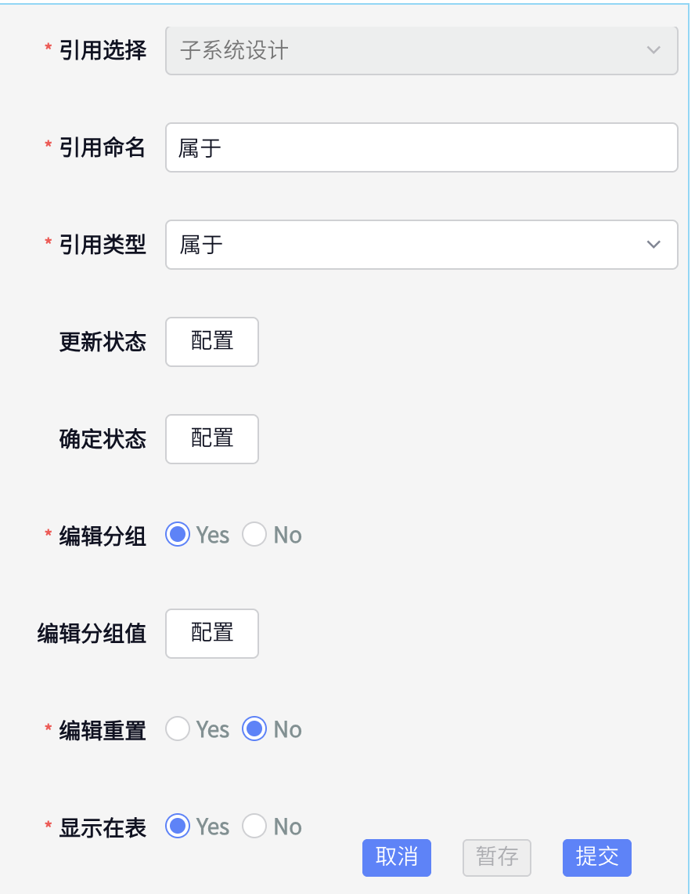
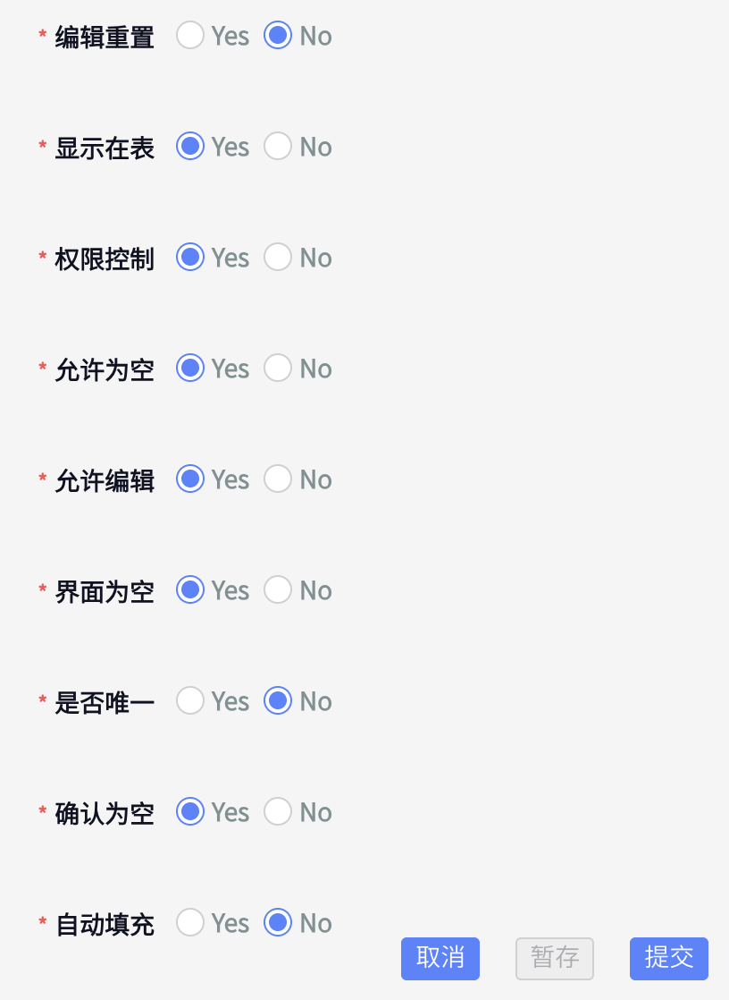
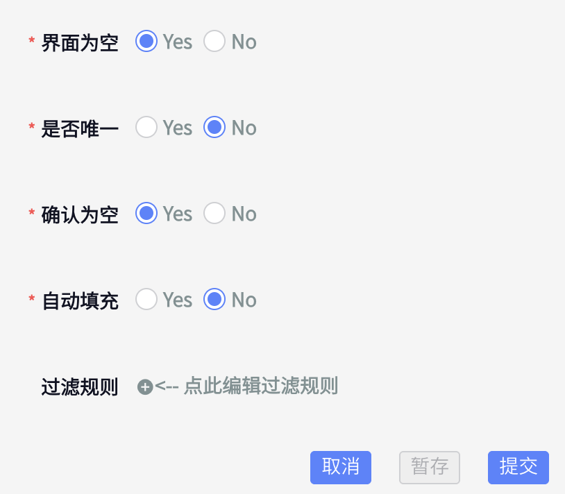

- 【子系统设计】详细参数如上，直接按照上面的填写并提交

4. **删除属性**：删除其中的【单元设计】属性

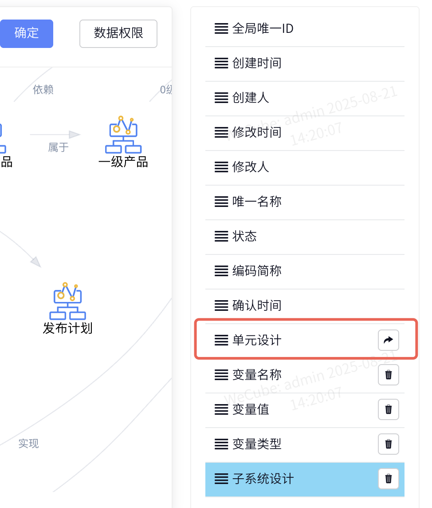

5. **修改变量名称**：将【变量名称】中的 【是否唯一】改成 【NO】，模型配置修改完毕

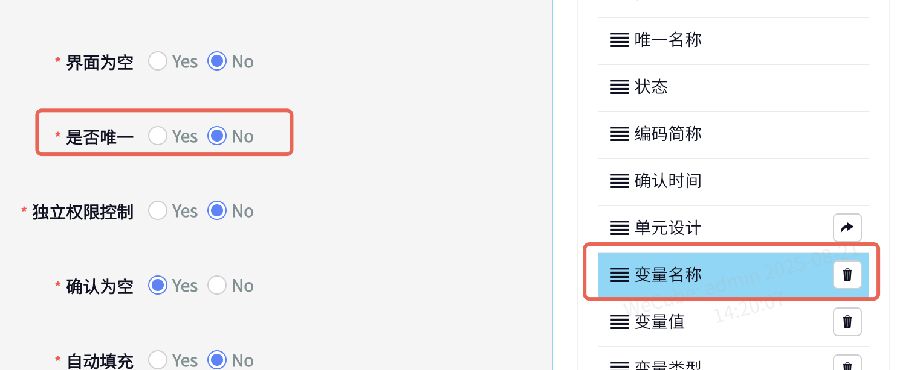

6. **修改唯一名称**：将【唯一名称】中的这几个参数进行对应修改

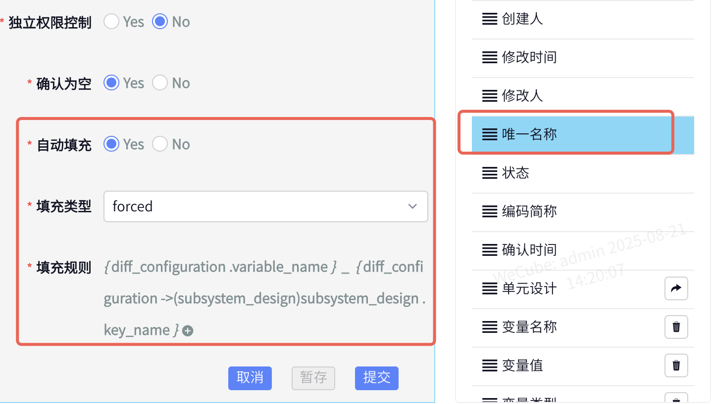

7. **修改唯一名称**：在 协同-插件注册 页面，进入 wecmdb 插件（注意：是wecmdb插件，不是物料包插件）

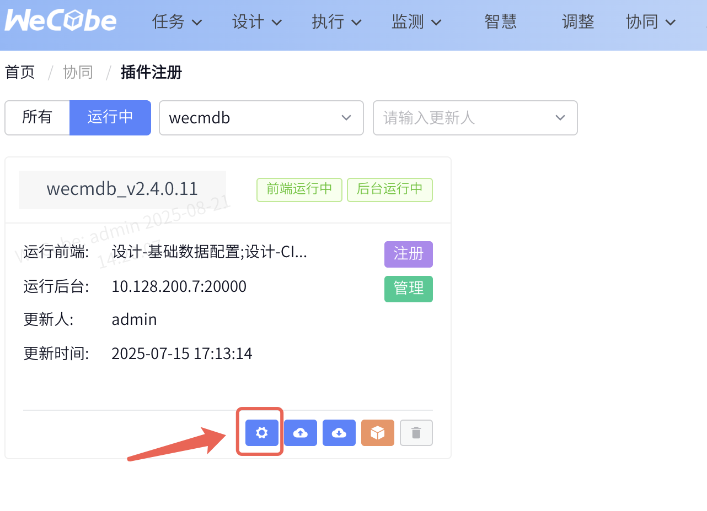

- 点击下面的配置icon 进入 【数据模型】页面

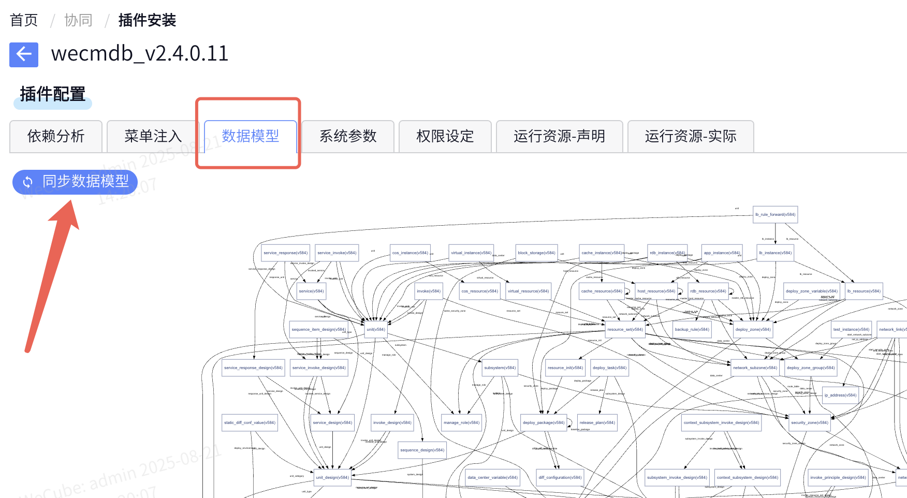
- 点击下面的【同步数据模型】按钮，这是是为了将上面模型的修改在整个平台同步，同步完成后，模型配置的修改就结束了

8. **执行脚本**：进入插件部署机器中，找到artifacts插件包的部署docker，执行下面的命令，实现对CMDB 差异化变量的更新。部署机器在这里可以找到：

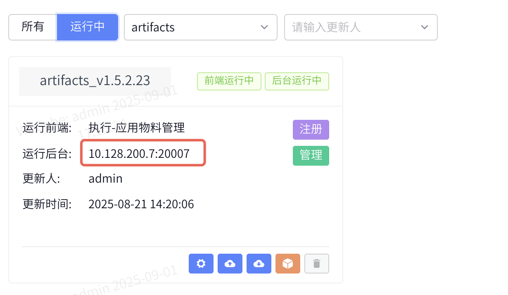
- 进入该机器，找到artifacts插件包的部署docker的容器Id，执行命令： docker exec DockerId artifacts_sync_diff_vars
（注意将上面的DockerId替换成artifacts的docker的容器id）
- 该条命令执行时间会根据差异化变量数目进行变化，预期会持续较长时间，请预留执行时间 （本操作的目的是将现有的差异化变量表中，填充 子系统设计id 这个参数值）

9. **可能问题及解决方案**：

- Q: 升级后出现变量替换失败，并且存在两个同名的变量

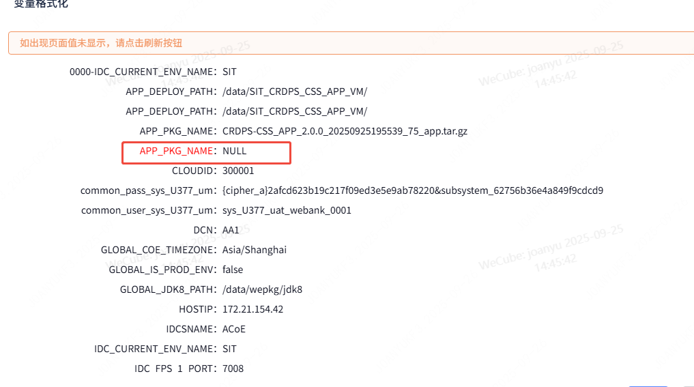
- A: 导致这个情况的原因存在两种可能，第一种原因是物料包中存在同名的两个变量（这个变量在CMDB中既是公共变量，又是私有变量，变量名相同），私有变量值为空，第二种原因是某个变量之前是公共变量，后面将其改成了私有变量，由于组合物料包中的变量存在继承，所以最新的物料包中绑定的变量存在同名的两个不同类型的变量。其中私有变量为空。
- 解决方案：在 数据管理（CI）- 差异化配置项 中，基于变量名找到所有的差异化变量，应该会看到对应子系统设计的变量的值为空，将对应子系统设计的变量的值，和类型为GLOBAL的值更新为一致，然后再次进入上面的问题页面，就能看到正确替换了。

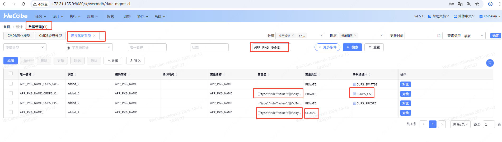

