# Artifact 开发环境配置

## 准备工作
1. 安装JDK
	
	需要在开发电脑上先安装JDK，请参考[JDK安装文档](jdk_install_guide.md)

2. 安装Eclipse
	
	需要在开发电脑上先安装Eclipse，请参考[Eclipse安装文档](eclipse_install_guide.md)


3. 安装node.js
	
	访问node.js官方网站：http://nodejs.cn/download， 下载v10.16.3版本。双击下载后的安装文件， 按默认配置进行安装。


## 导入工程
   可以直接从git上拉取代码， 也可以先将代码工程拉取到本地后， 再导入到Eclipse中， 本文以从本地导入为例。

1. 导入工程
	
	选择导入已有项目
	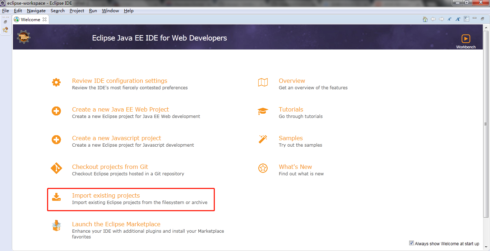
	
	选择已有maven工程
	
	
	选择artifact的代码目录作为根目录
	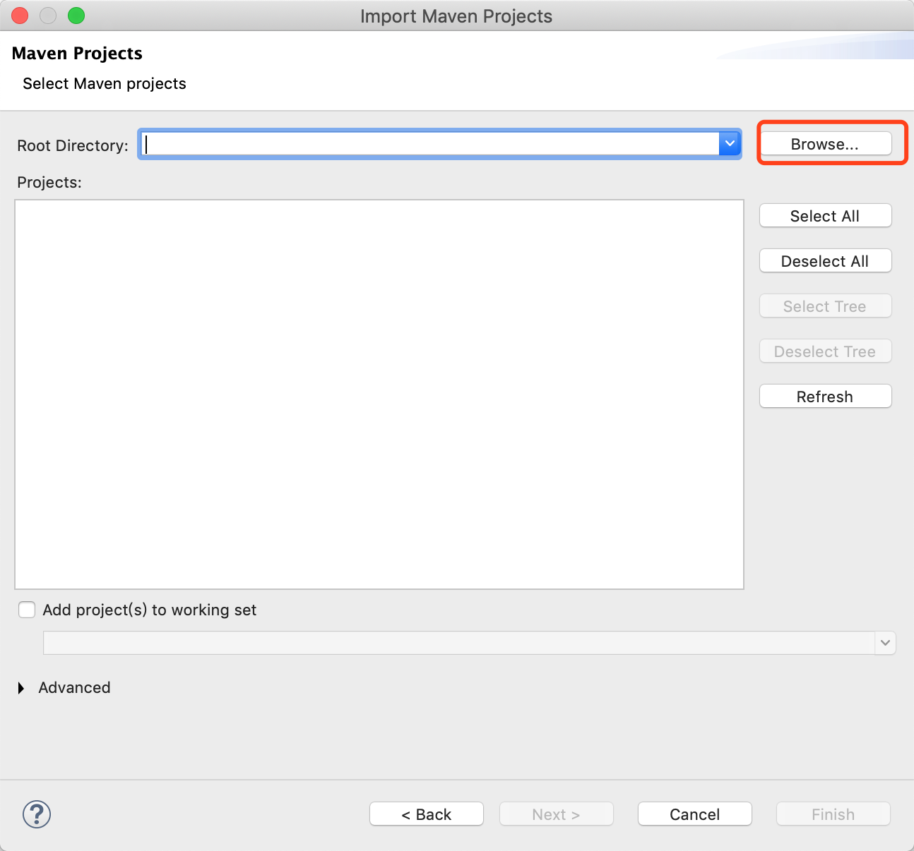
	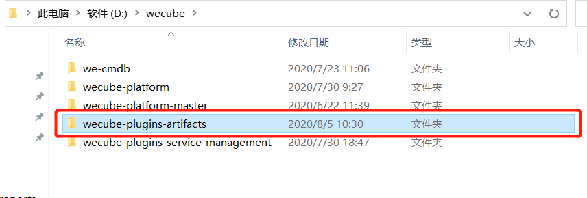
	
	确认后完成导入。
	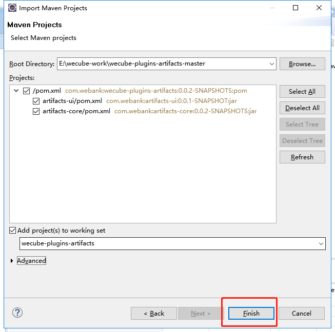
	

2. 切换视图
	
	导入项目后，需要在 *Window > Show View* 中选择 *Project Explorer*
	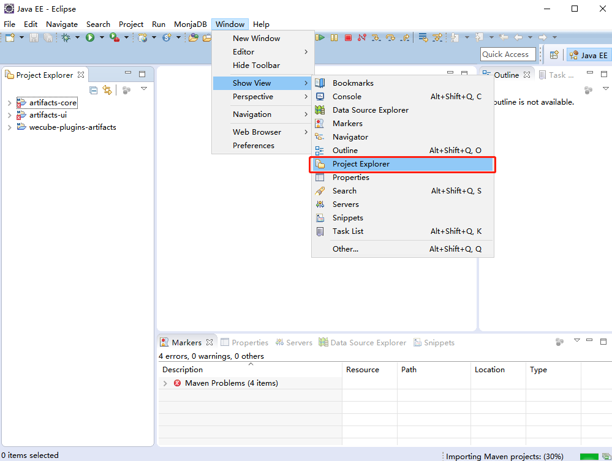

3. 配置文件

	在 *Project Explorer* 视图中，将 *application-local.yml* 复制一份，更名为 *application-dev.yml*
	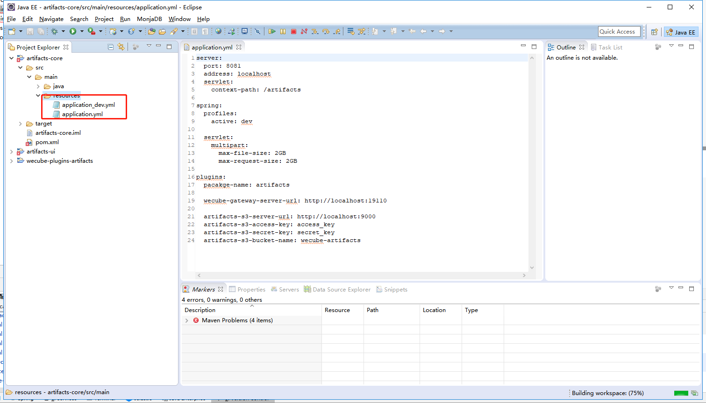
	
	打开 *application-dev.yml* ，默认使用的是H2内存数据库，内容如下：

	```
    server:
      port: 8091
      address: localhost
      servlet:
        context-path: /artifacts
    
    spring:
      profiles:
        active: dev
    
      servlet:
        multipart:
          max-file-size: 2GB
          max-request-size: 2GB
    
    plugins:
      pacakge-name: artifacts
    
      wecube-gateway-server-url: http://127.0.0.1:19090
      artifacts-nexus-server-url: http://127.0.0.1:18888
      artifacts-nexus-username: admin
      artifacts-nexus-password: admin123
      artifacts-nexus-Repository: maven-releases
      cmdb-artifact-path: artifact_path
    
      artifacts-s3-server-url: http://127.0.0.1:9000
      artifacts-s3-access-key: access_key
      artifacts-s3-secret-key: secret_key
      artifacts-s3-bucket-name: wecube-artifacts
	```

4. 启动Artifacts后端
	
	打开Window->Preferences窗口， 选择Java->Installed JREs，新增jdk配置，如下图

	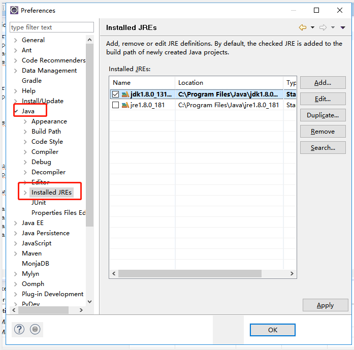

	下载依赖， 如下图：

	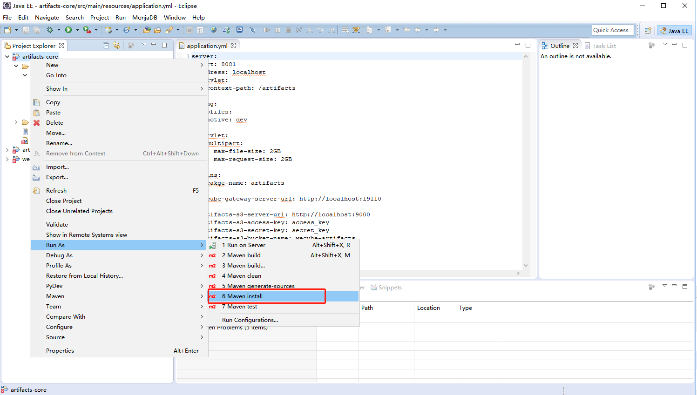
	
	启动

	
	
	在浏览器输入 *http://localhost:9080/artifacts/swagger-ui.html* 

	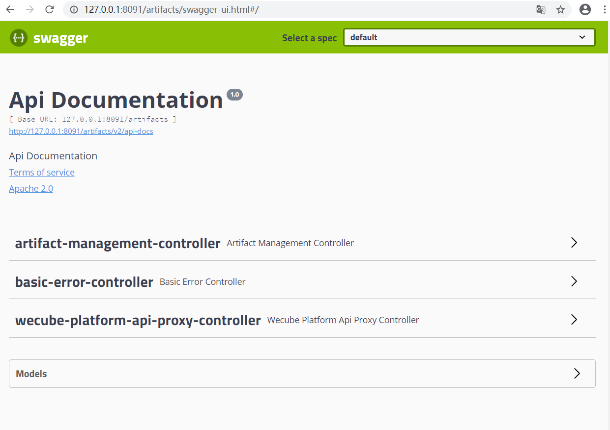


5. 启动Artifact前端
	
	运行CMD（Win+R或右下角点开始菜单的输入处），在展开的命令行窗口中,进入wecube-plugins-artifacts的代码子目录wecmdb-ui目录

	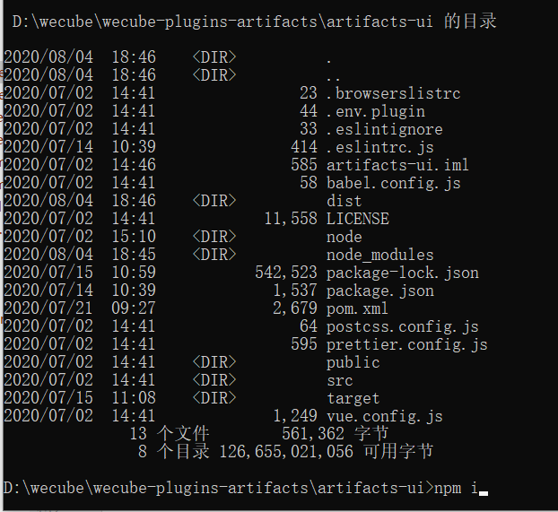
	
	执行npm安装命令
	
	```
	npm install
	```
	
	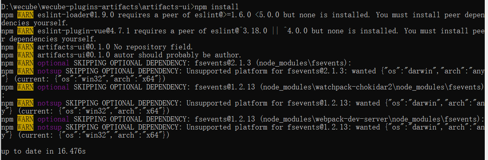

	安装完成后， 执行命令

    ```
	  npm start
	```

	如下图：

	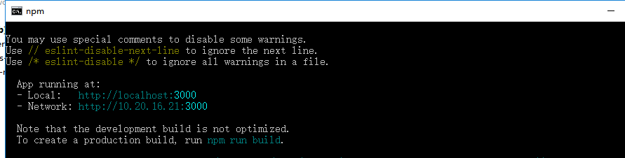

	服务已启动， 打开 *http://localhost:3000*, 可看到Artifact的页面

	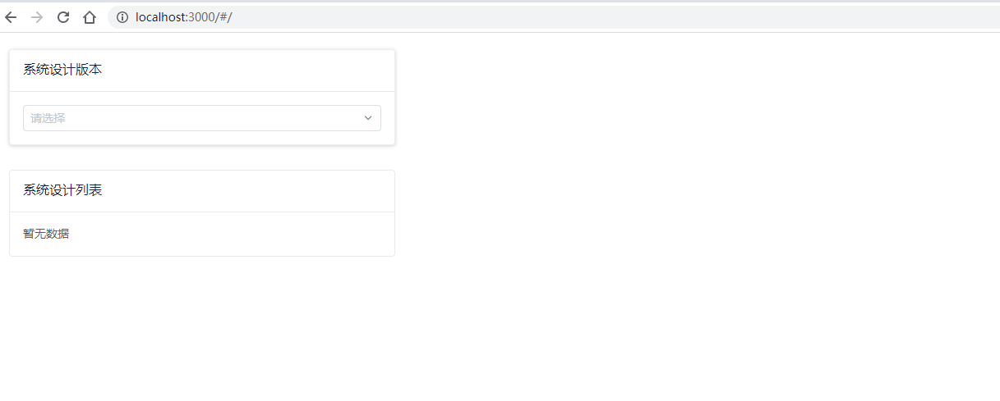